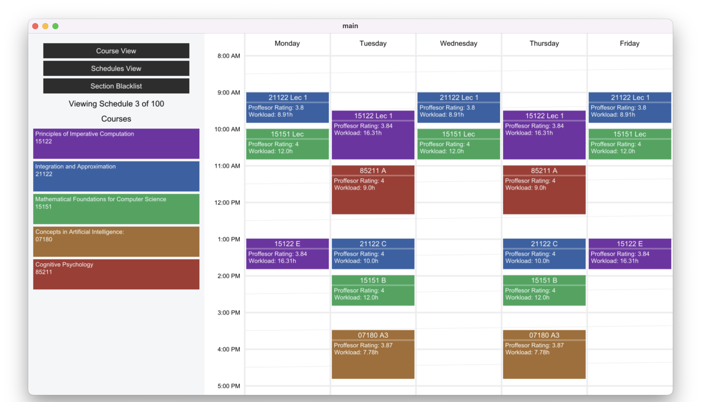
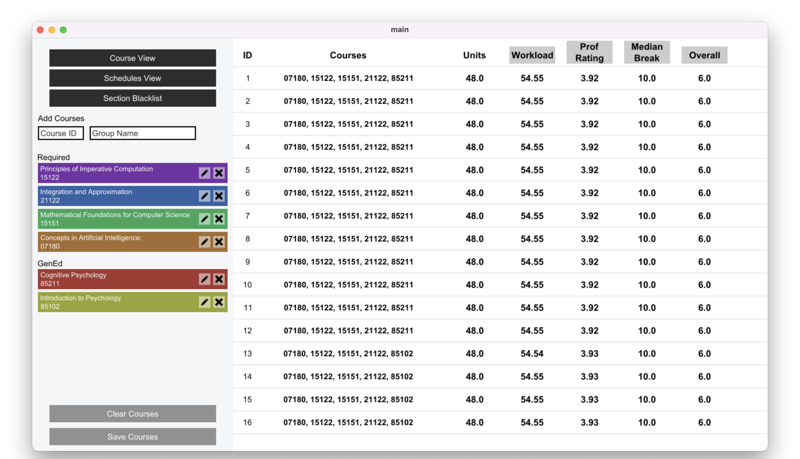
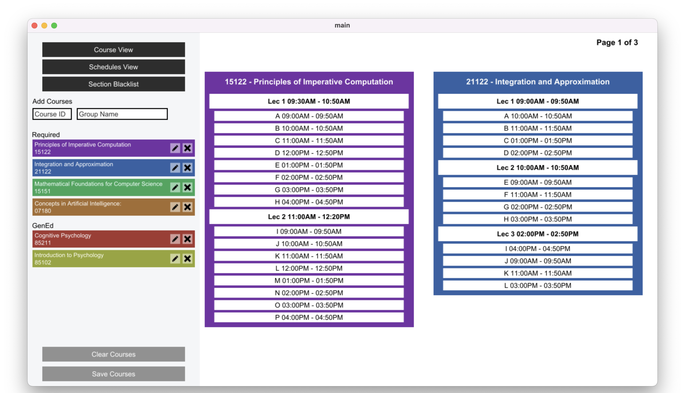

<!-- PROJECT LOGO -->
 

  
  <h3 align="center">CMU HackMySchedule</h3>
  

    A schedule planning application for Carnegie Mellon students.
  

<!-- TABLE OF CONTENTS -->
<h2 id="table-of-contents">Table of Contents</h2>
<ul>
<li><a href="#about-the-project">About the Project</a><ul>
<li><a href="#built-with">Built With</a></li>
</ul>
</li>
<li><a href="#getting-started">Getting Started</a><ul>
<li><a href="#prerequisites">Prerequisites</a></li>
<li><a href="#installation">Installation</a></li>
</ul>
</li>
<li><a href="#usage">Usage</a></li>
<li><a href="#roadmap">Roadmap</a></li>
<li><a href="#contributing">Contributing</a></li>
<li><a href="#license">License</a></li>
<li><a href="#contact">Contact</a></li>
</ul>
<!-- ABOUT THE PROJECT -->
<h2 id="about-the-project">About The Project</h2>
This application was the final submission to CMU's 15-112 term project assignment. Other projects like this can be seen on the course's [homepage](https://www.cs.cmu.edu/~112/index.html).

HackMySchedule is a schedule planner designed to assist students at Carnegie Mellon plan their schedules. It offers a user-friendly interface to rank various course combinations, helping you find the schedule that best fits your needs and preferences. It uses CMU&#39;s course catalog and student/teacher evaluations to rank schedules based on Workload, Instructor Rating, and Median Break. Lastly, specific lectures and recitations can be blacklisted to give more control over a schedule. 

Current Features

<ul>
<li>Schedule View</li>
<li>Course adding, removing and editing</li>
<li>Recitation and lecture blacklisting</li>
<li>Schedule sorting</li>
</ul>
<h3 id="built-with">Built With</h3>
<ul>
<li><a href="https://www.python.org/">Python</a></li>
<li>CMUGRAPHICS, Pandas</li>
</ul>
<!-- GETTING STARTED -->
<h2 id="getting-started">Getting Started</h2>

To run HackMySchedule, follow these steps.

<h3 id="prerequisites">Prerequisites</h3>
<ul>
<li>Python</li>
</ul>
<h3 id="installation">Installation</h3>
<ol>
<li>Clone the repo</li>
</ol>
<pre class="codeblock language-sh">git clone https://github.com/enzod3/CMU-HackMySchedule
</pre>
<ol start="2">
<li>Install the required packages</li>
</ol>
<pre class="codeblock language-sh">pip install cmu_graphics pandas
</pre>
<ol start="3">
<li>Start the program</li>
</ol>
<pre class="codeblock language-sh">cd src
python main.py
</pre>
<!-- Usage-->
<h2 id="usage">Usage</h2>

####Schedules View

<table>
  <tr>
    <td><strong>Pagination</strong></td>
    <td><kbd>←</kbd>, <kbd>→</kbd></td>
  </tr>
  <tr>
    <td><strong>CourseID Input</strong></td>
    <td>Type numbers</td>
  </tr>
  <tr>
    <td><strong>GroupName Input</strong></td>
    <td>Type letters</td>
  </tr>
  <tr>
    <td><strong>Add Course</strong></td>
    <td><kbd>⏎ Enter</kbd></td>
  </tr>
  <tr>
    <td><strong>View Course</strong></td>
    <td>Click Course</td>
  </tr>
</table>
 

####Courses View

<table>
  <tr>
    <td><strong>Pagination</strong></td>
    <td><kbd>←</kbd>, <kbd>→</kbd></td>
  </tr>
</table>
 

####Sections View

<table>
  <tr>
    <td><strong>Pagination</strong></td>
    <td><kbd>←</kbd>, <kbd>→</kbd></td>
  </tr>
  <tr>
    <td><strong>Blacklist</strong></td>
    <td>Click Section</td>
  </tr>
</table>
 

<!-- CONTRIBUTING -->
<h2 id="contributing">Contributing</h2>

Interested in contributing to HackMySchedule? Here&#39;s how you can help:

<ul>
<li><strong>Reporting Bugs</strong></li>
<li><strong>Suggesting Enhancements</strong></li>
<li><strong>Sending Pull Requests</strong></li>
</ul>
<!-- LICENSE -->
<h2 id="license">License</h2>

Distributed under the MIT License.

